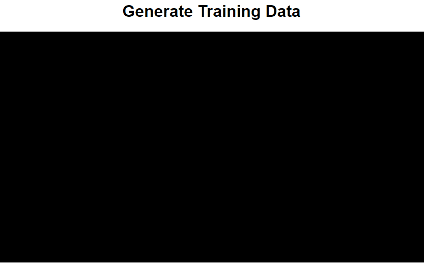

# HTML5 Gesture Recognition

### Overview
The purpose of this project is to demonstrate how an artificial neural network can be used to recognize gestures on webpages. The idea for this project was heavily inspired by Google’s Quick, Draw! game.<br>
This concept provides client-side code for tracking mouse and touch based movements for both mobile and desktop. A swipe on the screen by either a finger or mouse is collected by the browser and classified/encoded to a specific set of gestures by a neural network. The current prototype is a proof of concept and will only be trained on four types of gestures (up, down, left, right). The current plan is to implement the neural network in Tensorflow.js.

### Procedurally Generated Training Set
The training set was created automatically by a JavaScript client that generates artificial swipe data and normalizes it for the viewport. This data was then used to train the neural network.


<p align="center">
	
</p>

##### The structure of the collected data
```JSON
{
	"swipeType":"right",
	"xs": [
		0.2469352014010508,
		0.2679509632224168,
		0.29334500875656744,
		0.318739054290718,
		0.3380035026269702,
		0.34851138353765326,
		0.3502626970227671
	],
	"ys": [
		0.23309352517985613,
		0.23453237410071942,
		0.23597122302158274,
		0.23597122302158274,
		0.23453237410071942,
		0.23309352517985613,
		0.2316546762589928
	]
}
```
# Report sdjkfhalkjdfhalkhsdflkajshflkhaslkfhasdf


